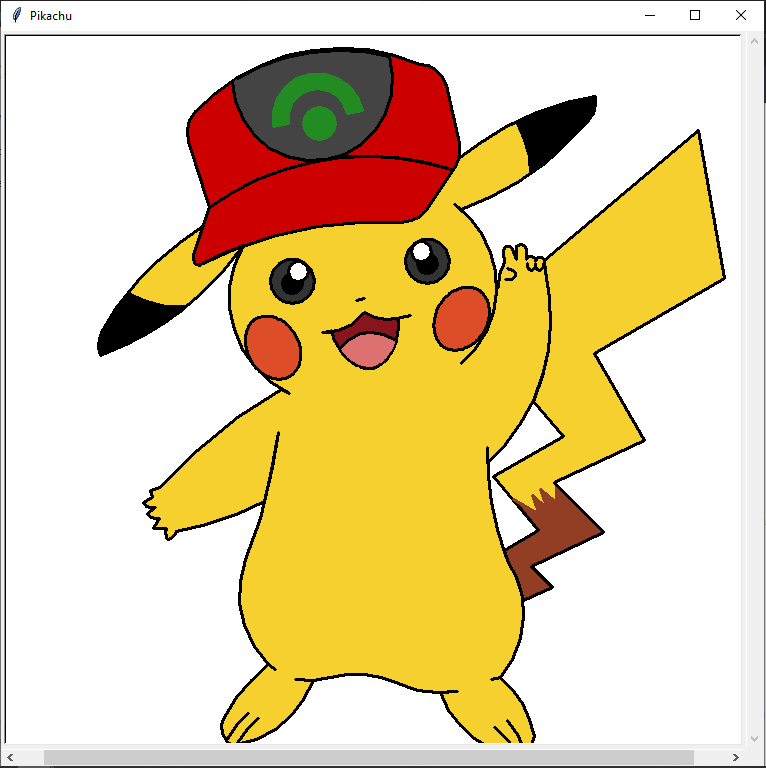
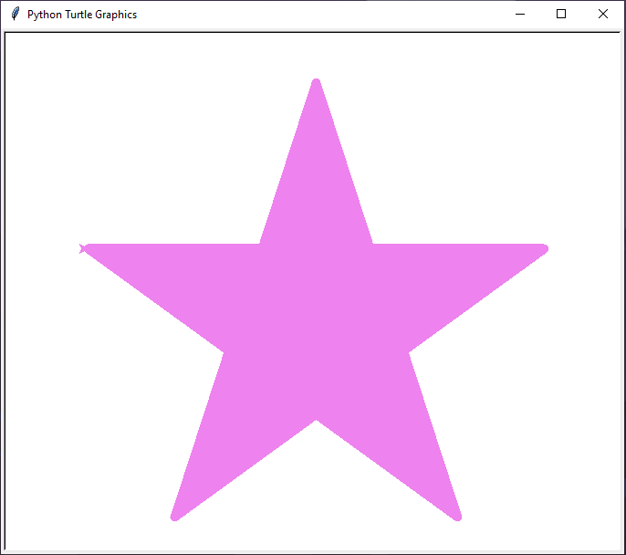
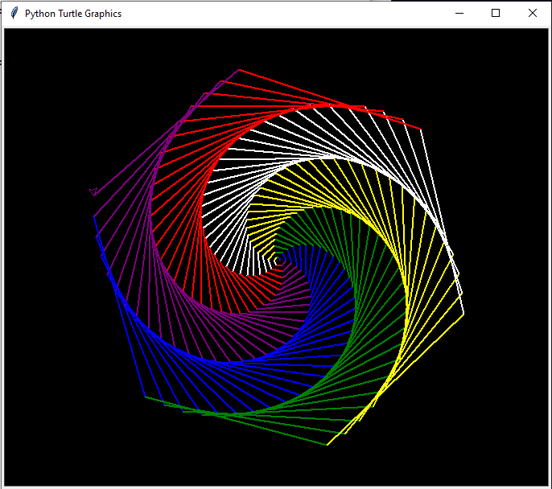
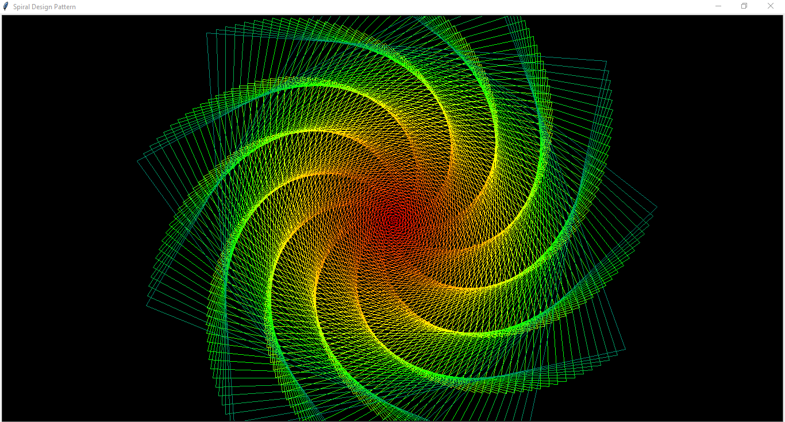
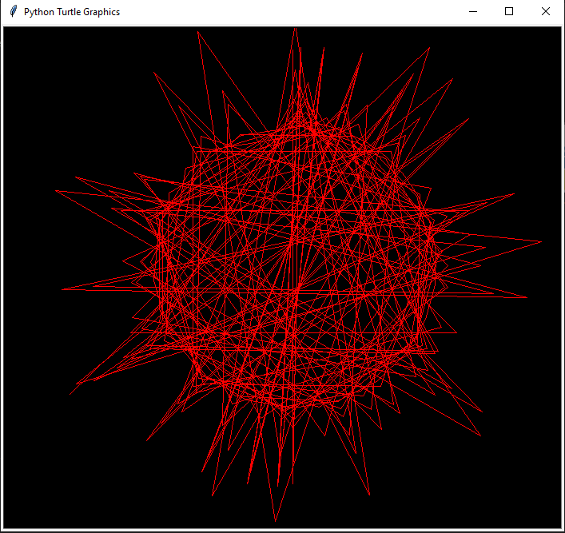
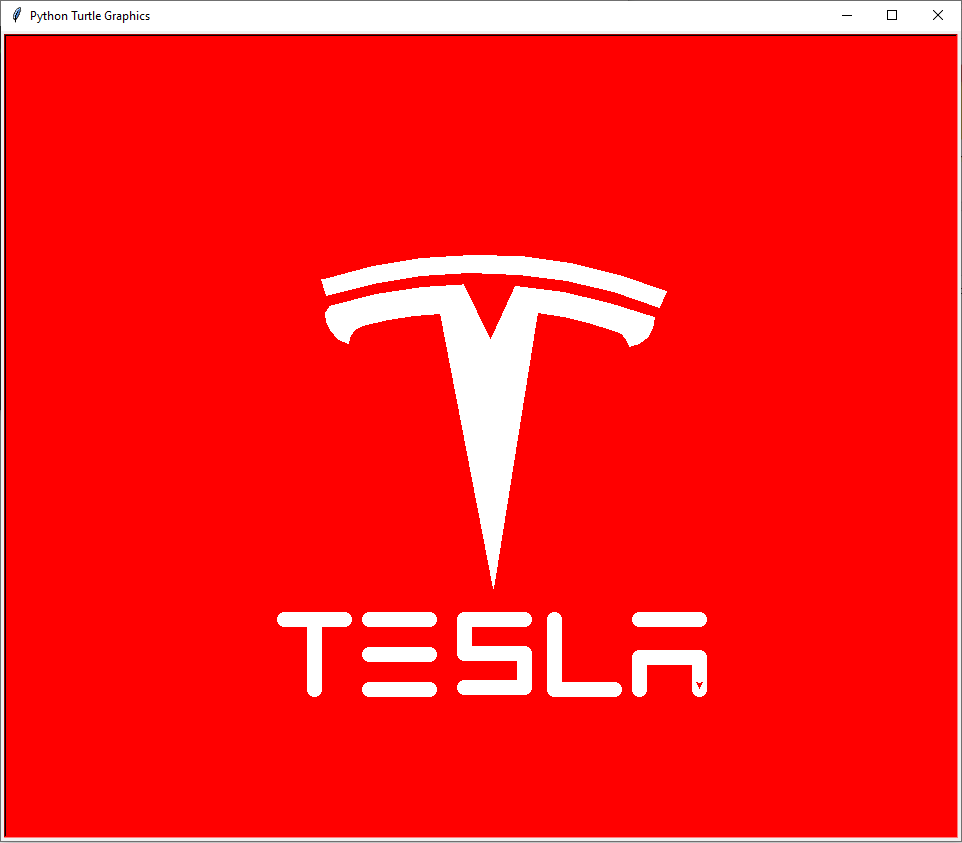
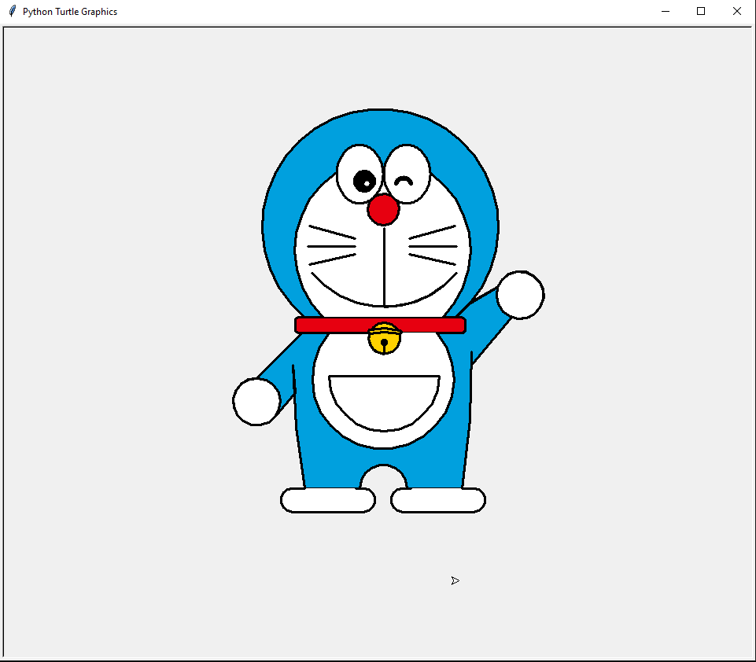
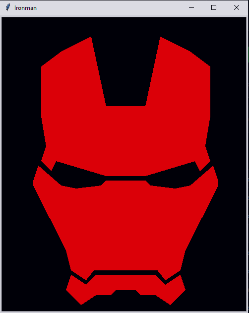

# Python Turtle Programs 

 
Hi guys, This repository contains all of the source code of turtle programs. 

## Table of Contents

1. [Introduction](#introduction)
2. [Pikachu](#pikachu)
3. [Rainbow Star](#rainbowstar)
4. [Hexagon Spiral](#hexagonspiral)
5. [Spiral Design](#spiraldesign)
6. [Vibrant Circle](#vibrantcircle)
7. [Square Spirograph](#squarespirograph)
8. [Tesla](#tesla)
9. [Doraemon](#doraemon)
10. [Ironman](#ironman)

## Introduction

Turtle graphics is a popular way for introducing programming to kids. Virtual turtles can be programmed to move around the screen. The turtle draws lines as it moves. The "turtle" could look like the turtle animal, an arrow, or be invisibile. The user can write turtle programs that draw beautiful shapes and learn to program at the same time.

The original Turtle software was developed by Wally Feurzig and Seymour Papert in 1966.

## Pikachu

## RainbowStar

## HexagonSpiral

## SpiralDesign

## VibrantCircle

## SquareSpirograph

## Tesla

## Doraemon

## Ironman

### Show some ❤️ by starring the repository!

